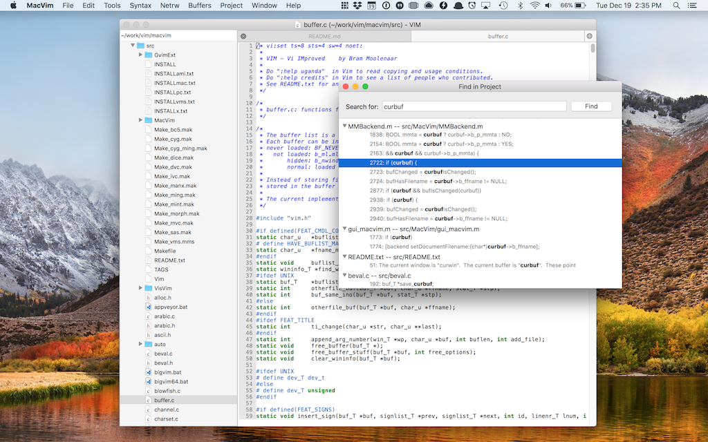

## MVP (MacVim-Project)

This fork contains a small set of extensions I (dougfales) wrote for my own use
as a developer who loves MacVim and uses it everyday.

I called these extensions macvim-project because I'm not very creative, and the
abbreviation MVP looks cool as a prefix to the files I had to add to this fork.  

Most of what I've implemented here was already available in Vim's core 
functionality or well known plugins:

* For a project tree, I could have just used
  [NERDTree](http://www.vim.org/scripts/script.php?script_id=1658).
* Instead of building a Find in Project window, I could have just used
  `:vimgrep`. 
* I could have just used [CtrlP](https://github.com/ctrlpvim/ctrlp.vim) instead
  of building the Fast Find window.
* Instead of a "project" concept, I could have just stuck with Vim sessions.

But I wanted things to work exactly how I wanted them to work. So I started
this fork. It doesn't make sense, I don't expect many people to find this
useful, and that's ok. Vim's a truly excellent piece of software and it has
been so useful to me over the years, and this is simply the way I use it now. 

## Features

### Project Drawer
A view of the directory your project is based in.

### Fast Open Window 
Just hit `⌘-shift-d` to open a file quickly.

### Find in Project Window
Hit `⌘-shift-f` to `git grep` for a piece of text.

### Welcome/Recent Projects Window
This window will greet you on startup so you can quickly get back to a project you opened before.

## Building & Running

This project should build in just the same way as MacVim. To get started, I do this:

1. `cd src`
2. `make`

If you use this fork, I'd love to hear from you. 
